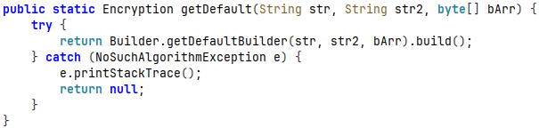
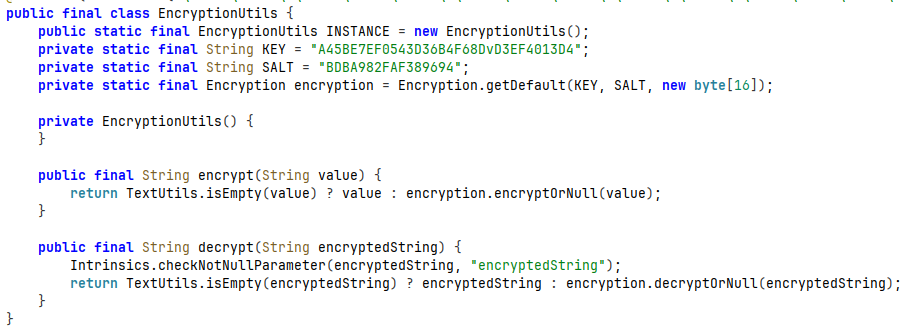
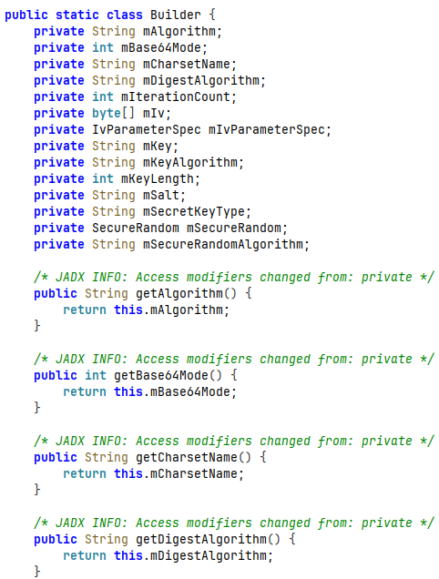
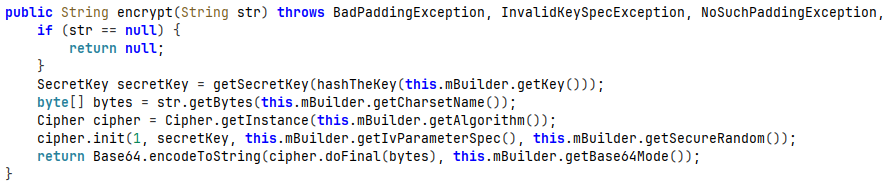
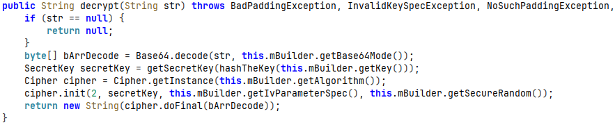
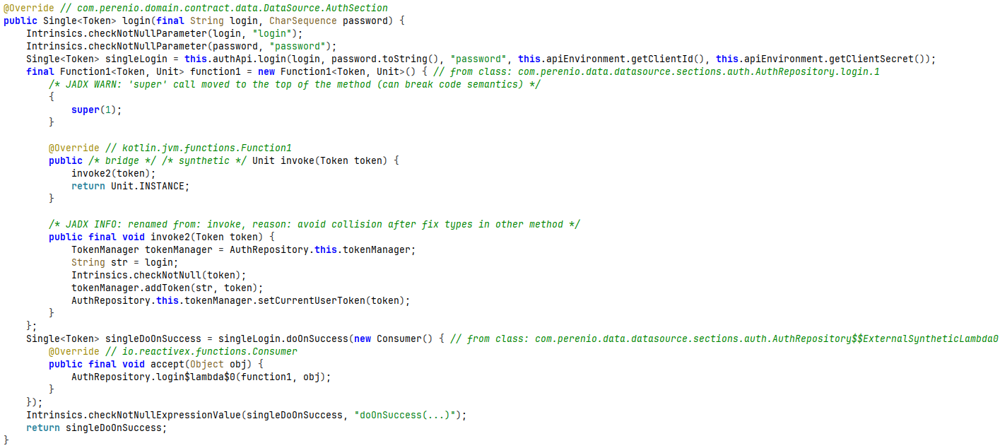
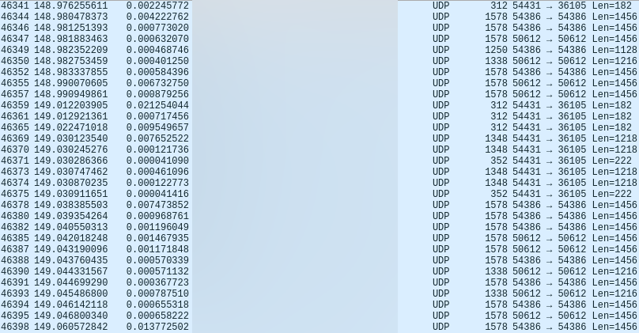
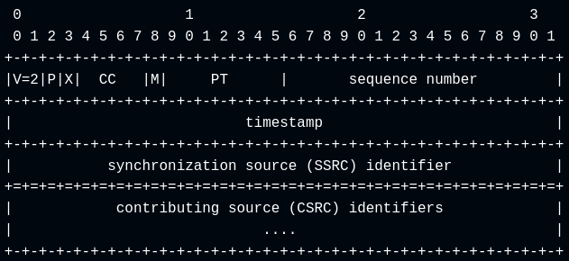
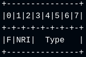
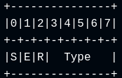

# Perenio Peifc01 IP Camera and Android Application Analysis
Analysis of cryptographic routines found within "Perenio Smart: Home and Office" Android application, as well as reconstructing Perenio Peifc01 IP camera's RTP over UDP video stream from a Wireshark packet capture

Table of Contents
=================
* [Initial Discovery](#initial-discovery)
* [Cryptography Implementation Analysis](#cryptography-implementation-analysis)
  * [Pulling Android Application to Host](#pulling-android-application-to-host)
  * [Application Analysis with JADX and Frida](#application-analysis-with-jadx-and-frida)
  * [Security Findings](#security-findings)
* [Login Sequence](#login-sequence)
* [Analysis of Media Stream (Audio/Video)](#analysis-of-media-stream-audiovideo)
  * [RTP Packet Structure](#rtp-packet-structure)
  * [Video Encoding](#video-encoding)
    * [FU Indicator](#fu-indicator)
    * [FU Header](#fu-header)
  * [Stream Reconstruction Script](#stream-reconstruction-script)
* [Conclusion](#conclusion)

# Initial Discovery

Using [my custom Frida script](https://codeshare.frida.re/@KostasEreksonas/crypto-discovery/) for cryptographic method detection in Android applications, I captured Java Cipher class doing a decryption operation, along with it's stack trace:

```json
{
  "objectId": "Cipher-30236645",
  "timestamp": 1789412643454,
  "lastSeen": 1789412643488,
  "instanceOverload": "1. [Cipher.getInstance(java.lang.String) -> static Cipher]",
  "transformation": "AES/CBC/PKCS5Padding",
  "algorithm": "AES/CBC/PKCS5Padding",
  "runtimeClass": "javax.crypto.Cipher",
  "providerName": "AndroidOpenSSL",
  "providerVersion": 1,
  "providerInfo": "Android's OpenSSL-backed security provider",
  "providerClass": "com.android.org.conscrypt.OpenSSLProvider",
  "updateInputs": [],
  "updateInputsLen": [],
  "updateOutputs": [],
  "updateOutputsLen": [],
  "initOverload": "6. [Cipher.init(int opmode, Key key, AlgorithmParameterSpec params, SecureRandom random) -> void]",
  "opmode": 2,
  "opmodeString": "DECRYPT",
  "blockSize": 16,
  "keyClass": "javax.crypto.spec.SecretKeySpec",
  "keyAlgorithm": "AES",
  "keyFormat": "RAW",
  "keyBytesHex": "4bf14ea15d7bd3bbfcf9b7d9acc6db5c",
  "keyBytesString": "K.N.]{.........\\",
  "keyBytesFingerprint": "32862b80:16",
  "parameterClass": "javax.crypto.spec.IvParameterSpec",
  "iv": "000000000000000000000000000000",
  "ivFingerprint": "69691905:16",
  "secureRandom": "java.security.SecureRandom",
  "finalOverload": "2. [Cipher.doFinal(byte[] input) -> byte[]]",
  "bytesWritten": 96,
  "input": "7c354a11ebcff3abe4b3c1c359cb16c14a1685851abaca3fd80b2cb8ba1b423f398944c108b2ba6096d43fb0317c5c17 ... [64 more bytes]",
  "output": "{\"commonPrefs\":{\"display_rate_us_after\":0,\"permi ... [48 more bytes]",
  "outputFingerprint": "a29ad7a9:96",
  "stackTrace": [
    "java.lang.Throwable",
    "at javax.crypto.Cipher.doFinal(Native Method)",
    "at se.simbio.encryption.Encryption.decrypt(Encryption.java:179)",
    "at se.simbio.encryption.Encryption.decryptOrNull(Encryption.java:193)",
    "at com.perenio.data.util.EncryptionUtils.decrypt(EncryptionUtils.kt:21)",
    "at com.perenio.data.local.sharedpreference.base.AbsEncryptPreferencesProvider.getStringDecrypt(AbsEncryptPreferencesProvider.kt:15)",
    "at com.perenio.data.local.sharedpreference.base.AbsEncryptPreferencesProvider.getStringDecrypt$default(AbsEncryptPreferencesProvider.kt:13)",
    "at com.perenio.data.local.sharedpreference.SharedPreferencesProvider.<init>(SharedPreferencesProvider.kt:149)",
    "at com.perenio.smarthome.di.module.data.SharedPreferencesModule.provideSharedPreferencesProvider(SharedPreferencesModule.kt:25)",
    "at com.perenio.smarthome.di.module.data.SharedPreferencesModule_ProvideSharedPreferencesProviderFactory.provideSharedPreferencesProvider(SharedPreferencesModule_ProvideSharedPreferencesProviderFactory.java:56)",
    "at com.perenio.smarthome.di.module.data.SharedPreferencesModule_ProvideSharedPreferencesProviderFactory.get(SharedPreferencesModule_ProvideSharedPreferencesProviderFactory.java:44)",
    "at com.perenio.smarthome.di.module.data.SharedPreferencesModule_ProvideSharedPreferencesProviderFactory.get(SharedPreferencesModule_ProvideSharedPreferencesProviderFactory.java:14)",
    "at dagger.internal.DoubleCheck.get(DoubleCheck.java:47)",
    "at com.perenio.smarthome.di.module.data.SectionsModule_ProvideUserSectionFactory.get(SectionsModule_ProvideUserSectionFactory.java:68)",
    "at com.perenio.smarthome.di.module.data.SectionsModule_ProvideUserSectionFactory.get(SectionsModule_ProvideUserSectionFactory.java:19)",
    "at dagger.internal.DoubleCheck.get(DoubleCheck.java:47)",
    "at com.perenio.smarthome.di.component.DaggerAppComponent$AppComponentImpl.synchronizeSubscriptionsUseCase(DaggerAppComponent.java:2416)",
    "at com.perenio.smarthome.di.component.DaggerAppComponent$AppComponentImpl.injectPerenioApp(DaggerAppComponent.java:3815)",
    "at com.perenio.smarthome.di.component.DaggerAppComponent$AppComponentImpl.inject(DaggerAppComponent.java:3036)",
    "at com.perenio.smarthome.PerenioApp.onCreate(PerenioApp.kt:47)",
    "at android.app.Instrumentation.callApplicationOnCreate(Instrumentation.java:1385)",
    "at android.app.ActivityThread.handleBindApplication(ActivityThread.java:7830)",
    "at android.app.ActivityThread.handleBindApplication(Native Method)",
    "at android.app.ActivityThread.-$$Nest$mhandleBindApplication(Unknown Source:0)",
    "at android.app.ActivityThread$H.handleMessage(ActivityThread.java:2546)",
    "at android.os.Handler.dispatchMessage(Handler.java:110)",
    "at android.os.Looper.loopOnce(Looper.java:248)",
    "at android.os.Looper.loop(Looper.java:338)",
    "at android.app.ActivityThread.main(ActivityThread.java:9068)",
    "at java.lang.reflect.Method.invoke(Native Method)",
    "at com.android.internal.os.RuntimeInit$MethodAndArgsCaller.run(RuntimeInit.java:596)",
    "at com.android.internal.os.ZygoteInit.main(ZygoteInit.java:932)\n"
  ]
}
```

# Cryptography Implementation Analysis

## Pulling Android Application to Host

Name of the Android application is `com.perenio.smarthome`.

1. List relevant packages:

```sh
adb shell pm list packages | grep <package-name>
```

2. Get full path name for the package with `adb shell pm path <package-name>`:

```
package:/data/app/~~s-<base64-string>/<package-name>-n_K_-<base64-string>/base.apk
package:/data/app/~~s-<base64-string>/<package-name>-n_K_-<base64-string>/split_asset_pack.apk
package:/data/app/~~s-<base64-string>/<package-name>-n_K_-<base64-string>/split_config.arm64_v8a.apk
package:/data/app/~~s-<base64-string>/<package-name>-n_K_-<base64-string>/split_config.en.apk
package:/data/app/~~s-<base64-string>/<package-name>-n_K_-<base64-string>/split_config.xxhdpi.apk
```

Core application logic is stored in `base.apk` with assets and configs stored in separate .apk files. For the purposes of current research, only the base application file was analyzed.

3. Pull the `base.apk` to host machine:

```sh
adb pull /data/app/~~s-<base64-string>/<package-name>-n_K_-<base64-string>/base.apk
```

4. [A shell script that automates package pulling process can be found by following this link](https://github.com/KostasEreksonas/android_analysis/blob/main/scripts/pull_application).

## Application Analysis with JADX and Frida

This section covers analysis of Perenio application's data encryption and decryption methods. Both static analysis with JADX and dynamic analysis using Frida were performed.

***One important thing to note:*** the described encryption method is a local-only encryption method, i.e. it only protects data that is at rest in local storage. Data transmitted via network is protected by TLSv1.3 sessions and SSL certificates pinned into Perenio app.

Searching for `se.simbio.encryption.Encryption` in Jadx-gui leads to the decompiled code of the `Encryption` class (whose scope is set to public).

The class has `getDefault(String str, String str2, byte[] bArr) { ... }` method that creates an object of `Builder` class, responsible for providing information necessary to construct key and initialization vector (IV) for AES encryption:



This method is called from `com.perenio.data.util.EncryptionUtils` class and gets hardcoded key and salt values provided as arguments:



The builder method itself builds a key from provided information and has setters and getters for every private variable:



Overloading the `getDefaultBuilder` method (along with `decrypt` method) using Frida discloses that the following information is being received during Perenio application's initialization sequence:

During the app initialization stage, Frida overloads for `getDefaultBuilder` and `decrypt` methods captured the following information about building a key and IV for AES decryption operation:

```json
{
  "threadId": "2",
  "builder": {
    "algorithm": "AES/CBC/PKCS5Padding",
    "modeBase64": 0,
    "charsetName": "UTF8",
    "digestAlgorithm": "SHA1",
    "iterationCount": 1,
    "iv": "00000000000000000000000000000000",
    "ivParameterSpec": null,
    "key": "A45BE7EF0543D36B4F68DvD3EF4013D4",
    "keyAlgorithm": "AES",
    "keyLength": 128,
    "salt": "BDBA982FAF389694",
    "secretKeyType": "PBKDF2WithHmacSHA1",
    "secureRandom": null,
    "secureRandomAlgorithm": "SHA1PRNG"
  },
  "getDefaultInfo": {
    "key": "A45BE7EF0543D36B4F68DvD3EF4013D4",
    "salt": "BDBA982FAF389694",
    "defaultKey": "00000000000000000000000000000000"
  },
  "encrypted": "fDVKEevP86vks8HDWcsWwUoWhYUauso/2AssuLobQj85iUTBCLK6YJbUP7AxfFwXHjKn3F3URNgh\n/2SvLbPOPqS3wos0B9h8m/Q9jtfCVvEt3TqiLY0dSeff12q/2BmDRKpBQYHFeO+F8UKtMuNdoA==\n    ",
  "hashTheKeyInfo": {
    "keyPlaintext": "A45BE7EF0543D36B4F68DvD3EF4013D4",
    "keyHashed": "zb6XIjgHtuii5dEcQuiY/8QFluA\n"
  },
  "SKFGetInstance": {
    "secretKeyType": "PBKDF2WithHmacSHA1",
    "providerName": "BC",
    "providerVersion": 1.77,
    "providerInfo": "BouncyCastle Security Provider v1.77"
  },
  "SKFGenerateSecret": {
    "algorithm": "PBKDF2WithHmacSHA1",
    "PBEKeySpecInfo": {
      "iterationCount": 1,
      "keyLength": 128,
      "password": "zb6XIjgHtuii5dEcQuiY/8QFluA\n",
      "salt": "BDBA982FAF389694"
    },
    "secretKey": "4bf14ea15d7bd3bbfcf9b7d9acc6db5c"
  },
  "SKSInit": {
    "key": "4bf14ea15d7bd3bbfcf9b7d9acc6db5c",
    "Algorithm": "AES"
  },
  "getSecretKeyInfo": {
    "algorithm": "AES",
    "keyMaterial": "4bf14ea15d7bd3bbfcf9b7d9acc6db5c"
  },
  "cryptoInitInfo": {
    "opmode": 2,
    "opmodeString": "DECRYPT",
    "key": {
      "keyClass": "javax.crypto.spec.SecretKeySpec",
      "keyAlgorithm": "AES",
      "keyFormat": "RAW",
      "keyEncoded": "4bf14ea15d7bd3bbfcf9b7d9acc6db5c"
    },
    "parameters": {
      "parameterClass": "javax.crypto.spec.IvParameterSpec",
      "parameterValue": "00000000000000000000000000000000"
    },
    "secureRandom": {
      "secureRandomClass": "java.security.SecureRandom",
      "secureRandomAlgorithm": "SHA1PRNG",
      "secureRandomProvider": "AndroidOpenSSL version 1.0"
    }
  },
  "decrypted": {
    "commonPrefs": {
      "display_rate_us_after": 0,
      "permission_event_severity": "event"
    },
    "devicePrefs": {}
  }
}
```

Secret key for both `encrypt` and `decrypt` operations is built upon a hardcoded key in `hashTheKey` method:


As an example, let's take `Encryption.encrypt()` method:



This method works roughly as follows:

1. The key for `getSecretKey` method is prepared by `hashTheKey` method:
    * MessageDigest object gets instantiated with a digest algorithm (SHA1 in collected samples).
    * The digest object gets updated with hardcoded key (encoded with `utf-8`).
    * Hash computation is finished with a call to `digest()` method, the final hash being encoded to Base64 string (with NO_PADDING flag enabled) and converted to a char array.
2. The `getSecretKey` method instantiates `SecretKeyFactory` object:
    * Type of the final secret key is set as `PBKDF2WithHmacSHA1`.
    * `PBEKeySpec` is instantiated with the following parameters:
      * Iteration count: 1.
      * Key length: 128-bit.
      * Password: output from `hashTheKey` method (PBKDF2 password represented as a Java character array).
      * Salt: a value that is also hardcoded into Perenio Android application.
    * The `generateSecret` method computes secret key from the previously listed parameters. 
3. Java `Cipher` object is instantiated with the transformation `AES/CBC/PKCS5Padding` and is initialized with:
    * Operation mode (opmode):
      * 1 = encryption
      * 2 = decryption.
    * Secret key.
    * Initialization vector (IV).
    * Secure random (this field is initialized but not used).
4. Message is encrypted using `Cipher.doFinal()`.

`Encryption.decrypt()` method follows the same Cipher pattern, just with `opmode = 2`:



[Javascript code for this Frida overload is available in this repository as perenio.js.](./perenio.js)
[Python reimplementation of the described encryption method is available at pythonImplementations/crypto.py.](./pythonImplementations/crypto.py)

Sample outputs of dynamic analysis script [can be found in sampleLogs directory](./sampleLogs/)

## Security Findings

A few notable considerations regarding the cryptographic methods used in the Perenio Android application:  

1. Key and salt values are hardcoded into the Perenio Android application.
2. Initialization vector (IV) is initialized as a 16 byte long value of all-zeros.
3. Having a static key combined with all-zero IV makes AES-CBC deterministic - same plaintext inputs produce the same ciphertext outputs.
4. SecureRandom is instantiated but is never used to derive IV.
5. Password-Based Key Derivation Function 2 (PBKDF2) has an iteration count of ***1***:
    * PBKDF2 iteration count determines how many times the hashing process of key material should be repeated.
    * On the first iteration, input key is mixed with the salt and hashed.
    * Subsequent iterations takes hash output of previous iteration and re-hashes it with the same method.
    * As a final step, outputs of all iterations are combined (typically with a bitwise XOR) to produce the final encryption key.
    * [OWASP recommends 1,400,000 iterations for PBKDF2-HMAC-SHA1 (legacy) key derivation function](https://cheatsheetseries.owasp.org/cheatsheets/Password_Storage_Cheat_Sheet.html).
    * Perenio app's crypto implementation repeats the hashing process exactly 1 time, which, combined with hardcoded key, salt and all-zero IV provide no real security on the local data.
6. Key, derived with the aforementioned parameters, is being reused for subsequent local cryptographic operations.

***Note:*** This is an app-only encryption method. Data in-transit is still being guarded by TLSv1.3, as well as SSL certificates pinned within Perenio Android application.

Given the points listed above, the in-app security layer reads more like an obfuscation layer rather than true random, non-deterministic encryption method.

# Login Sequence

Login sequence was intercepted using Mitmproxy and captured with Wireshark for analysis. However, network communications between Perenio Android application and the vendor's remote servers have a couple of protections:

1. TLSv1.3 session is negotiated before any data reaches the network.
2. Perenio Android application has SSL pinning enabled, meaning that only devices having Perenio's own CA certificates are trusted with the plain text data.

Tricking Android device into trusting my proxy for establishing TLSv1.3 session with it is as simple as injecting Mitmproxy's CA certificates onto Android system trust store ([Bash automation script for this process can be found here](https://github.com/KostasEreksonas/android_analysis/blob/main/scripts/inject_certificates)). For pinned certificate bypass, Frida objection with `android sslpinning disable` script was used.

***Note:*** For dynamic analysis with Frida, `frida-server` must be loaded and run on a target device as a daemon, so that a Frida client on a host machine could have a "harness" to be able to attach to a process and inspect/modify it.

A quick description of the algorithm used for capturing plain text communication between Perenio Android app and vendor's servers might be this:

1. Injecting Mitmproxy's CA certificate onto Android system trust store.
2. Push `frida-server-<version>-android-arm64` onto a rooted Android device or an emulator via `adb`.
3. Start `frida-server` on Android device.
4. Set up Wi-Fi proxy on Android device to point at <IP>:<PORT> of actual proxy (for example, if a proxy runs on 192.168.X.X:8080, Android device's Wi-Fi proxy needs to target 192.168.X.X:8080).
5. Open Perenio application on Android device.
6. Grab the process ID (PID) of Perenio app with `uv run frida-ps -U | grep -i perenio`.
7. Attach Frida objection to Perenio application with `uv run objection -g "${pid}" explore`.
8. Start `android sslpinning disable` script.
9. On host machine, start Mitmproxy with `SSLKEYLOGFILE=/path/to/key/log/file mitmproxy --listen-port <PORT> --ssl-insecure`. Saving SSL keys onto a file is necessary, because, even if Wireshark and Mitmproxy run concurrently, Wireshark does not log these keys itself. And without these keys, Wireshark ***can not*** decrypt the captured TLS sessions.
10. Start Wireshark (with root privileges) and start network traffic capture (capture same network interface on which the proxy runs).
11. Proceed to log into Perenio account.

[A more comprehensive guide on HTTPS proxy setup and SSL pinning bypass can be found here.](https://medium.com/meetcyber/analyzing-mobile-application-http-s-traffic-using-burp-suite-and-frida-e3e91c085e91)

The method described above, the following plain text login request was captured:

```
:method: POST
:scheme: https
:path: /auth/realms/aaa.kaa/protocol/openid-connect/token
:authority: oauth.perenio.com
tenantid: perenio
content-type: application/x-www-form-urlencoded
content-length: 144
accept-encoding: gzip
user-agent: okhttp/4.10.0

username=<email>&password=<account-password>&grant_type=password&client_id=perenio-app&client_secret=<client-secret>
.............:status: 200
date: Tue, 15 Sep 2026 14:59:55 GMT
content-type: application/json
vary: Accept-Encoding
cache-control: no-store
set-cookie: KEYCLOAK_LOCALE=; Version=1; Comment=Expiring cookie; Expires=Thu, 01-Jan-1970 00:00:10 GMT; Max-Age=0; Path=/auth/realms/aaa.kaa/; Secure; HttpOnly
set-cookie: KC_RESTART=; Version=1; Expires=Thu, 01-Jan-1970 00:00:10 GMT; Max-Age=0; Path=/auth/realms/aaa.kaa/; Secure; HttpOnly
x-xss-protection: 1; mode=block
pragma: no-cache
x-frame-options: SAMEORIGIN
strict-transport-security: max-age=15724800; includeSubDomains
x-content-type-options: nosniff
content-encoding: gzip

{"access_token":"<access-token>","expires_in":864000,"refresh_expires_in":51840000,"refresh_token":"<refresh-token>","token_type":"bearer","not-before-policy":0,"session_state":"<session-state>","scope":"profile email"}
```

A few insights from the login request:

1. Login request body includes a parameter list with:
    * Username (email).
    * Password.
    * Grant type = password.
    * Client ID - client is Perenio Android application.
    * Client secret - (seemingly) random UUID.
2. The access token is valid for 10 days while refresh token expires after 600 days.
3. Session state differs with each login request (tested with a Python reimplementation of login request).

Heading back to the decompiled Perenio application, the login function is implemented in `com.perenio.data.datasource.sections.auth.AuthRepository` function:



With this information obtained from Wireshark packet capture, I decided to write a proof-of-concept Python script that POSTs a login request to an endpoint controlled by Perenio, receives an authorization token and queries `hxxps[://]oauth[.]perenio[.com/auth/realms/aaa[.]kaa/users/me` endpoint to get user information of my account. The script is called [sampleRequest.py and can be found in pythonImplementations folder](./pythonImplementations/sampleRequest.py).

Script also queries a third endpoint - `registrationStatus` - to check whether an account with a given email address has been registered.

Response if account exists:

```json
{
    "status": "EXISTS"
}
```

Response if account does not exist:

```json
{
    "status": "NOT_EXISTS"
}
```

I have ***not*** tested the rate limits on this endpoint, but it potentially could be used to enumerate existing Perenio accounts.

Sample response to login request:

```json
{
    "access_token": "<access-token>",
    "expires_in": 864000,
    "refresh_expires_in": 51840000,
    "refresh_token": "<refresh-token>",
    "token_type": "bearer",
    "not-before-policy": 0,
    "session_state": "<session-state>",
    "scope": "profile email"
}
```

Sample response to user information query:

```json
{
    "uid": "<user-id>",
    "countryCode": "LT",
    "email": "<email>",
    "language": "EN",
    "nickname": "<nickname>"
}
```

This also further proves that encryption methods described previously are local-only as these HTTP requests and responses contain plain text body - the encryption aspect is handed to TLSv1.3 and pinned SSL certificates.

[The script can also be found as sampleRequest.py in pythonImplementations folder](./pythonImplementations/sampleRequest.py)

# Analysis of Media Stream (Audio/Video)

Perenio Peifc01 IP camera captures and transmits both audio and video streams. A sample stream was collected using `Comfast CF-922AC` USB Wi-Fi adapter in monitor mode.

Packet collection process can be described as follows:

1. Figure out adapter's network interface:
```
ip a
```
2. Figure out a wireless channel of relevant Wi-Fi network:
```
nmcli device wifi list
```
3. Restart Comfast Wi-Fi adapter in monitor mode:
```
sudo airmon-ng start <comfast-interface> <channel-number>
```
4. Start Wireshark and start packet capture on `<comfast-interface>mon` interface.
5. Connect IP camera and smartphone to Wi-Fi (Important: connect camera and smartphone to Wi-Fi ***after*** starting packet capture - Wireshark needs to capture 4-way handshake to derive cryptographic keys for Wi-Fi network traffic decryption).
6. Start Perenio application on Android device and access IP camera's video stream - Wireshark should capture this data as of now.

Wireshark shows heavy UDP traffic on ports `50612`, `54386` and `54431`:



The datagrams themselves seem to contain highly structured data - decoding them as Real-time Transport Protocol (RTP) on Wireshark with `Right click on UDP packet -> Decode as -> RTP` reveals that the captured UDP data is audio/video stream relay between Perenio Peifc01 IP camera and a smartphone via vendor controlled Amazon AWS EC2 instance. The following structure can be inferred from this packet capture:

|Port number|Protocol|Purpose|
|:---------:|:------:|:-----:|
|50612|RTP over UDP|Audio stream `IP camera -> EC2 instance`|
|54386|RTP over UDP|Video stream `IP camera -> EC2 instance`|
|54431|SRTP over UDP|Stream relay `EC2 instance -> smartphone`|

IP camera sends video/audio streams as plaintext RTP data over the network to an Amazon AWS EC2 instance, controlled by the vendor. EC2 instance then relays combined audio/video stream to Android application via SRTP (Secure RTP) channel.

## RTP Packet Structure

RTP header, [as per RFC3550 specification](https://www.rfc-editor.org/info/rfc3550/#section-5.1), has the following structure:

1. **Version (V - 2 bits):** identifies RTP version.
2. **Padding (P - 1 bit):** if set, the packet contains one or more padding octets at the end that are not part of payload.
3. **Extension (X - 1 bit):** if set, fixed header must be followed by exactly one header extension.
4. **CSRC count (CC - 4 bits):** number of CSRC identifiers that follow fixed header.
5. **Marker (M - 1 bit):** intended to allow significant events (e.g. frame boundaries) to be marked in packet stream.
6. **Payload type (PT - 7 bits):** format of RTP payload.
7. **Sequence number (16 bits):** random number that increments by one for each RTP data packet.
8. **Timestamp (32 bits):** sampling instant of the first octet in RTP data packet.
9. **Synchronization source (SSRC) identifier (32bits):** identifies a synchronization source that ***should*** be selected randomly.

Visual RTP header representation from RFC3550 specification is presented below:



After a fixed header and CSRC identifiers (if present, RTP packet can have 0 to 15 32-bit long items as CSRC list entries right after SSRC), payload is added to the RTP packet. If padding is set to 1, a certain amount of padding bytes are appended to the packet after payload. Count of padding bytes is stored as a ***last*** byte of RTP packet (count includes this last byte as well).

## Video Encoding

As a video stream codec, H.264 (also known as Advanced Video Coding - AVC) is used. When a video is encoded with a standard like H.264, the stream is sliced into Network Abstraction Layer (NAL) units for reliable data transmission over a network. However, RTP over UDP has a limit for how large a single network packet can be. This limit is called Maximum Transmission Unit (MTU) and for Ethernet/Wi-Fi networks it usually is 1500 bytes, ***including*** packet headers. Accounting for Ethernet/IPv4/UDP/RTP headers leaves 1460 bytes ***at most*** for the payload (additional header information is added to RTP packet if the packet has CSRC identifiers and/or is being sent via VPN/IPSec tunnel).

Anyways, a large NAL unit can exceed single MTU, which means that such a NAL unit has to be split into multiple RTP packets for a successful transmission. For this purpose, H.264 has a defined Fragmentation Unit (FU), comprised of 1-byte FU Indicator and 1-byte FU Header. NAL header is reconstructed with `Original NAL Header Byte = (FU Indicator & 0xE0) | (FU Header & 0x1F)`

### FU Indicator

FU Indicator is constructed against [RFC 6184 standard, section 1.3](https://www.rfc-editor.org/info/rfc6184/#section-1.3):

|Bits|Name|Description|
|:--:|:--:|:---------:|
|0|F|forbidden_zero_bit|
|1-2|NRI|nal_ref_idc|
|3-7|Type|nal_unit_type|

1. **Forbidden zero bit:** normally equals 0. If this bit is set to 1, it indicates that a syntax violation / bit error was detected.
2. **NAL reference IDC (NRI):** when it equals 0, it means that this NAL unit is not used for reference picture reconstruction. Greater values indicate that NAL unit is required to maintain integrity of reference pictures.
3. **NAL unit type.** For example, Fragmentation Unit A (FU-A) has an unit type of `28`.

Visual FU Indicator structure from [RFC 6184 standard, section 1.3](https://www.rfc-editor.org/info/rfc6184/#section-1.3) is presented below:



### FU Header

FU Header byte is present only on NAL Fragmentation Units and is constructed against [RFC 6184 standard, section 5.8](https://www.rfc-editor.org/info/rfc6184/#section-5.8)

|Bits|Name|Description|
|:--:|:--:|:---------:|
|0|S|Start bit of fragmented NAL unit|
|1|E|End bit of fragmented NAL unit|
|2|R|Reserved bit - must equal 0 and ignored by the receiver|
|3-7|Type|NAL unit type|

Visual FU Header structure from [RFC 6184 standard, section 5.8](https://www.rfc-editor.org/info/rfc6184/#section-5.8) is presented below:



When a NAL unit is fragmented into FU-A (and FU-B) units, the original one-byte NAL header is reconstructed by preserving the F and NRI bits from the FU indicator and taking the NAL-unit type from the FU header

```
(FU Identifier & 0xE0) | (FU Header & 0x1F)
```

This operation swaps fragmentation unit type (28 for FU-A and 29 for FU-B) with the type of actual video data in NALU.

## Stream Reconstruction Script

Stream reconstruction script is [available as streamExtraction.py script in pythonImplementations folder](./pythonImplementations/streamExtraction.py).

As of now, only the relevant features for Perenio Peifc01 IP camera's stream reconstruction are included in this script:

1. Fragmentation Unit A (FU-A) reassembly into Network Abstraction Layer (NAL) unit.
2. Reassembling RTP L16 ([as defined in RFC 3551, section 4.5.11](https://www.rfc-editor.org/info/rfc3551/#section-4.5.11)) raw uncompressed audio data samples into a `.wav` audio file.
3. Parsing fixed header fields of RTP packet.

Features that are not included in the script:

1. Fragmentation Unit B (FU-B) reassembly into Network Abstraction Layer (NAL) unit.
2. RTP padding removal, when it exists.
3. Parsing (optional) CSRC fields of a RTP header.
4. Encoding separate audio/video streams into a single media file.
5. Audio / video synchronization and frame timing for muxing.

The script, however, produces playable audio and video files, with a reconstructed video frame presented below:


# Conclusion

Key points to summarize the security research of Perenio application:
1. Cryptographic method analysis of `Perenio Smart: Home and Office` Android application revealed a few issues with how local data encryption is implemented.
2. After successful login to Perenio account, `accessToken` that is valid for 10 days is issued while the validity period of `refreshToken` is 600 days.
3. Perenio Peifc01 IP camera sends RTP packets over UDP with unencrypted audio and video streams to an Amazon AWS EC2 instance, meaning that the network traffic could be captured and audio / video data from Peifc01 IP camera be reconstructed by someone who has:
    * Wi-Fi Pre-Shared Key (PSK) for the Wireless Local Area Network (WLAN), where Peifc01 IP camera resides.
    * Wi-Fi adapter in monitor mode.
    * Captures 4-way handshake as Peifc01 IP camera connects to the network.
 on a same Local Area Network (LAN), knows Wi-Fi pre-shared key (PSK) and  .
4. AWS EC2 instance relays the encoded file with combined audio/video to the Perenio Android application via Secure RTP (SRTP).